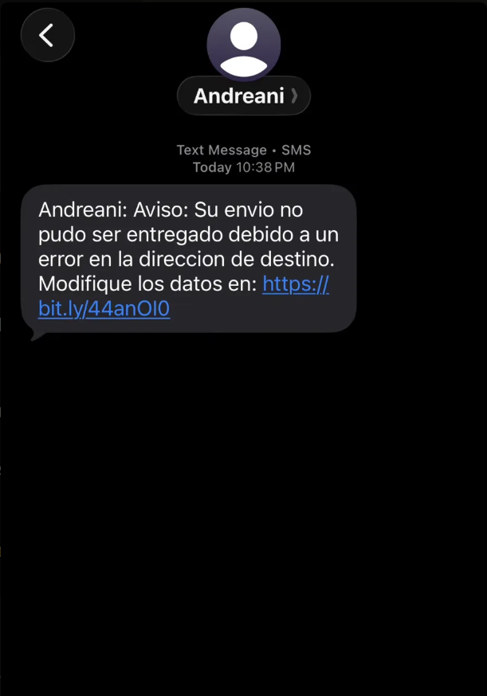
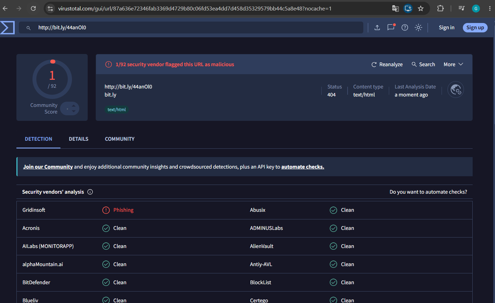
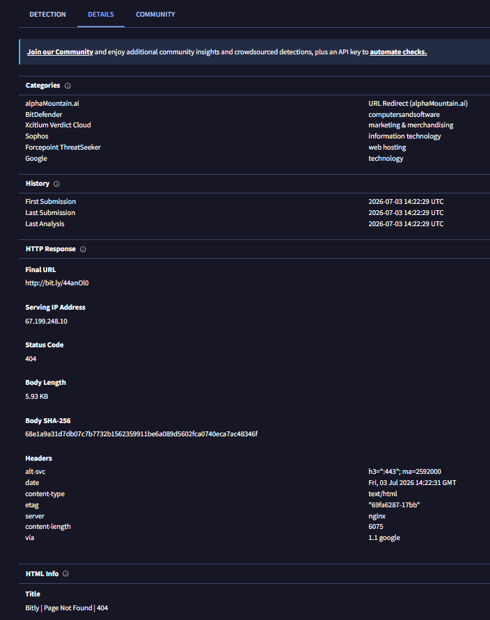

# That "Andreani" Delivery Text Was Phishing — Here's How I Confirmed It

I got this text on my phone claiming to be from Andreani, the courier company, saying my package couldn't be delivered because of an address error:

*"Andreani: Aviso: Su envio no pudo ser entregado debido a un error en la direccion de destino. Modifique los datos en: bit.ly/44anOl0"*

I wasn't expecting a delivery, but that's not really the tell — the tell is everything else about this message.

## Why I didn't trust it

A few things stood out before I even thought about touching the link:

- **The sender wasn't an official short code.** Andreani doesn't send delivery notices from a random SMS number.
- **It's built entirely around urgency.** "Your package failed to deliver, fix it now or..." is the oldest trick in the book — it wants you reacting, not thinking.
- **It's hiding behind a bit.ly link.** There's no reason a legitimate courier needs to shorten a link to their own address-correction page. Shorteners exist here for one purpose: to hide where you're actually going.

That's basically the whole playbook for smishing in one message.

## Checking it properly

Instead of clicking it, I ran the URL through VirusTotal:

Only 1 out of 92 vendors — Gridinsoft — flagged it, and by the time I scanned it the link was already returning a 404. At first glance that almost looks like a "clean" result. It's not.

The Details tab is what makes this interesting. The **Final URL** field still shows the same bit.ly link — it never redirected anywhere. The serving IP (`67.199.248.10`), the `nginx` server header, and a response body titled *"Bitly | Page Not Found | 404"* all point to one thing: **Bitly itself** is answering that request, not some phishing site on the other end. That's different from "the link expired on its own." It means Bitly killed the shortlink at the source — most likely pulled down after abuse reports, or a shortcode that never fully activated on the attacker's side before takedown.

The History section backs that up too: First Submission and Last Analysis both show 2026-07-03, the same day I got the text. I was scanning this thing within hours of it going out, and it was already dead.

This is where a lot of people would stop at "1/92" and assume it's fine, so it's worth being explicit about why that reasoning doesn't hold up:

- **Detection lags reality.** New phishing infrastructure often isn't indexed across all 92 engines yet — a low count on a fresh URL isn't the same as a low count on a URL that's been live for weeks.
- **Phishing kits are disposable.** Getting killed within hours — whether by Bitly's abuse team or the attacker rotating infrastructure — is normal behavior for this kind of campaign, not a sign it was never a threat.

So the "1/92" number isn't the verdict on its own. Combined with the sender, the urgency framing, the shortener, and how fast this link got taken down, it's enough to call this confidently malicious.

## Verdict

🔴 **Smishing.** Confirmed by behavioral indicators (spoofed sender, urgency, unsolicited), partial vendor confirmation on VirusTotal, and infrastructure-level evidence (the shortlink was already dead at the Bitly level within hours of being sent). The low overall detection ratio is explained by detection lag and the short-lived nature of phishing infrastructure — not by the link being safe.

## What I did

- Didn't click it, obviously.
- Blocked and reported the number.
- Checked my real Andreani situation (there wasn't one) directly through their official app instead of anything linked from the text.

## What this reinforced

The VirusTotal score isn't a yes/no answer, it's one input. If I'd looked at 1/92 in isolation and stopped there, I'd have gotten a false sense of safety. The context — who sent it, what it's asking for, how it's disguising the link — is what actually confirms the verdict. That's the habit I want to carry into an actual SOC seat: don't let one tool's score substitute for reading the whole picture.
